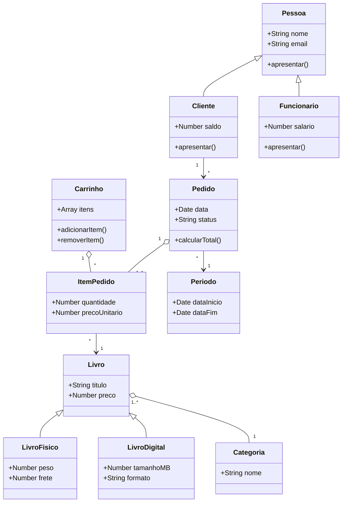

# API de Gestão da Livraria — Grupo 3

Projeto da UC de Programação Back-End — Curso Técnico em Desenvolvimento de Sistemas
Escola SENAI "Santo Paschoal Crepaldi" — Turma 1-2026-SESI_DEV_OC_1

## Integrantes

- Luis Miguel Pereira da Silva — @Luis Silva-del
- Ana Laura Aparecida Miranda Cardoso — @Ana
- Victor dos Santos Gonçalves da Silva — @Gonçalves918
- Maria Eduarda da Silva Mendes — @madumendes21

## Divisão de responsabilidades (Bloco 3 — Atividade 12)

| Integrante                           | Responsável por                                            |
| ------------------------------------ | ---------------------------------------------------------- |
| Luis Miguel Pereira da Silva         | POST (criar)                                               |
| Ana Laura Aparecida Miranda Cardoso  | PUT e PATCH (atualizar completo e parcial)                 |
| Victor dos Santos Gonçalves da Silva | DELETE (apagar)                                            |
| Maria Eduarda da Silva Mendes        | Testar tudo no Postman e preencher a tabela de verificação |

## Tecnologias

- Node.js
- Express
- npm

## Diagrama de Classes (UML)

## Experimento do Cabeçalho (Atividade 12 — Parte 3)

- **Status retornado:** 500 Internal Server Error (ou dados salvos como `undefined`).
- **Explicação:** O status ocorreu porque, ao enviar a requisição sem o cabeçalho `Content-Type: application/json`, o Express não consegue identificar o formato dos dados enviados. Com isso, o `req.body` fica vazio ou indefinido, impedindo o servidor de ler e salvar as propriedades do livro corretamente.
