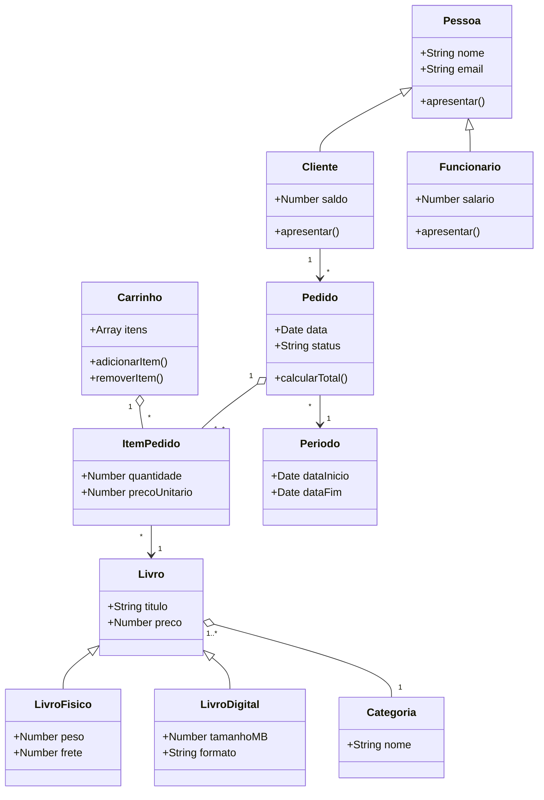

# API de Gestão da Livraria — Grupo 3

Projeto da UC de Programação Back-End — Curso Técnico em Desenvolvimento de Sistemas
Escola SENAI "Santo Paschoal Crepaldi" — Turma 1-2026-SESI_DEV_OC_1

## Integrantes

- Luis Miguel Pereira da Silva — @Luis Silva-del
- Ana Laura Aparecida Miranda Cardoso — @Ana
- Victor dos Santos Gonçalves da Silva — @Gonçalves918
- Maria Eduarda da Silva Mendes — @madumendes21

## Divisão de responsabilidades (Bloco 3 — Atividade 12)

| Integrante                           | Responsável por                                            |
| ------------------------------------ | ---------------------------------------------------------- |
| Luis Miguel Pereira da Silva         | POST (criar)                                               |
| Ana Laura Aparecida Miranda Cardoso  | PUT e PATCH (atualizar completo e parcial)                 |
| Victor dos Santos Gonçalves da Silva | DELETE (apagar)                                            |
| Maria Eduarda da Silva Mendes        | Testar tudo no Postman e preencher a tabela de verificação |

## Tecnologias

- Node.js
- Express
- npm

## Tabela de Verificação das Rotas (Atividade 12 — Parte 2)

| Método | URL | Status Esperado | Status Obtido |
| :--- | :--- | :---: | :---: |
| GET | /livros | 200 | 200 |
| GET | /livros/0 | 200 | 200 |
| GET | /livros/99 | 404 | 404 |
| POST | /livros | 201 | 201 |
| PUT | /livros/0 | 200 | 200 |
| PATCH | /livros/0 | 200 | 200 |
| DELETE | /livros/0 | 204 | 204 |
| GET | /livros/0 (depois do DELETE) | 404 | 404 |

## Experimento do Cabeçalho (Atividade 12 — Parte 3)

* **Status retornado:** `500 Internal Server Error`
* **Explicação:** O erro ocorreu porque, ao enviar a requisição sem o cabeçalho `Content-Type: application/json`, o servidor Express não consegue identificar o formato dos dados recebidos no corpo (body). Com isso, o `req.body` passa a chegar como `undefined`, fazendo com que o sistema quebre ao tentar acessar as propriedades do livro que não existem.

## Cronograma do Projeto

O cronograma da atividade de PSOF está em [`docs/cronograma.md`](docs/cronograma.md).

## Diagrama de Classes (UML)

```mermaid
classDiagram
    direction TB
    class Pessoa {
        +String nome
        +String email
        +apresentar()
    }
    class Cliente {
        +Number saldo
        +apresentar()
    }
    class Funcionario {
        +Number salario
        +apresentar()
    }
    class Categoria {
        +String nome
    }
    class Livro {
        +String titulo
        +Number preco
    }
    class LivroFisico {
        +Number peso
        +Number frete
    }
    class LivroDigital {
        +Number tamanhoMB
        +String formato
    }
    class Carrinho {
        +Array itens
        +adicionarItem()
        +removerItem()
    }
    class ItemPedido {
        +Number quantidade
        +Number precoUnitario
    }
    class Pedido {
        +Date data
        +String status
        +calcularTotal()
    }
    class Periodo {
        +Date dataInicio
        +Date dataFim
    }

    Pessoa <|-- Cliente
    Pessoa <|-- Funcionario
    Livro <|-- LivroFisico
    Livro <|-- LivroDigital
    Livro "1..*" o-- "1" Categoria
    Carrinho "1" o-- "*" ItemPedido
    Pedido "1" o-- "1..*" ItemPedido
    ItemPedido "*" --> "1" Livro
    Cliente "1" --> "*" Pedido
    Pedido "*" --> "1" Periodo
```
